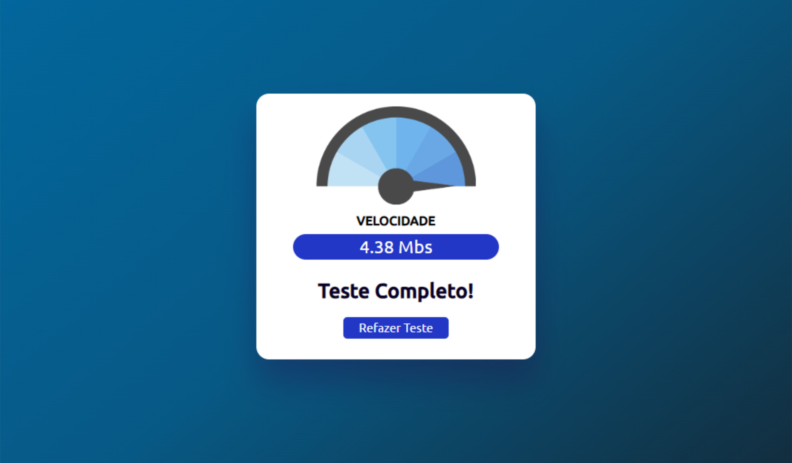

# Internet Speed Test

## Sobre o projeto

Um teste simples de velocidade de internet. O código obtém uma imagem aleatória do "unsplash.com" e faz um calculo de acordo com o tamanho da imagem e o tempo de download, resultando em uma velocidade aproximada.

## Informações

Projeto desenvolvido utilizando apenas HTML, CSS e JavaScript.

